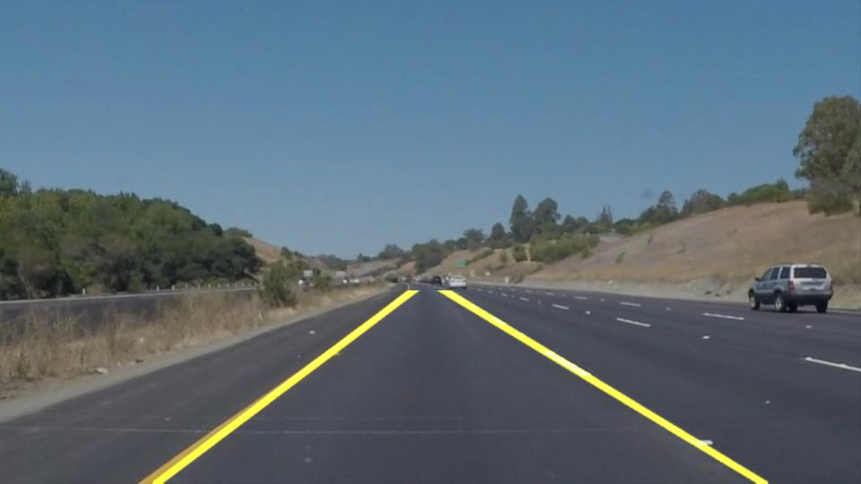

# **Finding Lane Lines on the Road** 

Overview
---

This is my solution to the first project in the [Udacity](https://www.udacity.com/) [Self-Driving Car Nanodegree](https://eu.udacity.com/course/self-driving-car-engineer-nanodegree--nd013).  For this project, the goal was to create a simple tool to detect the lane markings in image and video files by using basic computer vision approaches such as "Canny Edge detection" and the "Hough transform".

Structure
---
The entire project was completed in python and makes use of the [OpenCV](https://opencv.org/) library. The implementation can be found in the [jupyter notebook](P1.ipynb).

The program was tested on the images and videos in [test_images](test_images) and [test_videos](test_images) respectively. The results are saved in the respective _output folders.

For more details on my solution and some thoughts on shortcomings and improvements, see the [project_writeup](project_writeup).